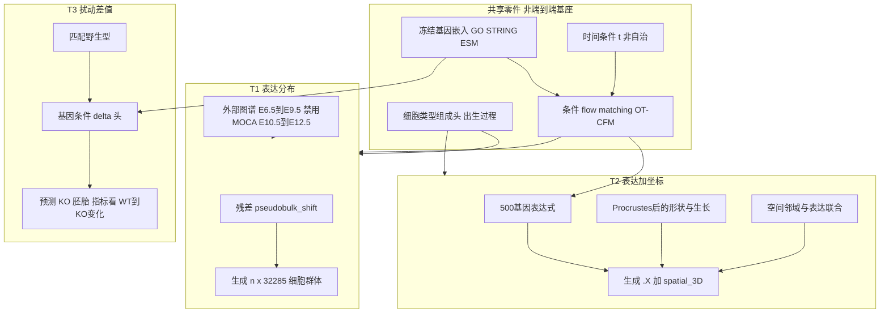

# Virtual Embryo 三项任务：架构与训练计划

- 比赛：[Virtual Embryo Challenge · NeurIPS 2026](https://virtualembryo.ai/challenge)
- 本地评分：[veckit](https://pypi.org/project/veckit/)
- 文档日期：2026-08-19
- 文中缩写与行话见文末 [术语表](#术语表)。

三项任务不要共用一个巨型单细胞基础模型当主力。以官方简单基线为地板，从头训练小的、指标对齐的生成模型；开源模型只提供基因嵌入、flow matching 实现和外部发育图谱，而不是端到端微调 scGPT。

---

## 结论先说

**不要把 scGPT / Geneformer / scFoundation 当竞赛主力。** 官方已经写明：Task 1 的 Neural ODE 打不过一行 `pseudobulk_shift`；Task 3 把野生型原样交回去绝对表达相关已达 0.956。独立基准（[Nature Methods 2025](https://www.nature.com/articles/s41592-025-02772-6)）也显示扰动预测上线性/均值基线经常超过这些基础模型。

正确策略是 **混合**：

- **从头搭小模型**（百万到千万参数级），直接优化比赛指标要的东西：群体分布、变化方向、新细胞类型出现、旋转不变的形状。
- **开源只当零件**：flow matching 库、冻结基因嵌入、官方 `dynode_flow` / `veckit`、允许窗口内的小鼠发育图谱。
- **三项任务共享设计语言，不共享一个 32k 基因的巨型 backbone**（T1 是全转录组，T2/T3 是 500-gene MERFISH，输入空间不同）。

默认算力按 **1 张 24–48GB GPU** 即可跑通。更大算力用来做消融和集成，而不是换一个 1B 参数的细胞 LLM。



---

## 为什么不能只微调开源细胞基础模型

- 比赛要的是 **未配对时间点之间的分布运输 + 新细胞类型出现**，不是对单细胞做分类或填补。
- T1 官方：E8.5 / E9.5 大约一半细胞在下一阶段没有同名前任；速度场外推搬不动后半群体。
- T2 坐标是 **每个胚胎局部坐标系**，对绝对 xyz 做 MSE 会被指标忽略；形状占 25%，邻域再占 25%。
- T3 训练扰动 **只有 1 个基因（Mab21l2）**，scGPT 那类在 Perturb-seq 上学到的细胞系 KO 先验很难迁移到胚胎形态发生；隐藏测试还是广泛表达的 β-catenin。
- 规则禁止用 held-out 阶段附近的实测数据。尤其 **MOCA（约 E9.5–E13.5）对 Task 1 基本不能用**，因为它落在外推保护窗 E9.5–E13.5 内。

开源模型的合法用法：当 **冻结特征**（基因向量、通路），或当 **对照实现**（[theislab/CellFlow](https://github.com/theislab/cellflow)、官方 `dynode_flow`），而不是当唯一提交模型。

---

## 统一设计：组合生成，而不是一条速度场

三个任务都拆成三块，官方基线打不过的原因也在这里：

1. **组成 / 出生**：哪些细胞类型出现、比例如何随时间变。用分类比例头，不用 OT 把旧细胞硬拉到新类型。
2. **类型内运输**：已有类型内部的表达如何漂移。用 **时间条件（非自治）OT-CFM**，不要自治 Neural ODE。
3. **全局变化**：全基因组 pseudobulk 方向。把官方 `pseudobulk_shift` 做成 **残差必选项**，深度模型只预测它解释不了的部分。

损失直接对齐评分，而不是普通 MSE：

| 任务 | 必做损失 | 对应指标 |
|------|----------|----------|
| T1 | 基因 logFC 排序 / 符号 + 子采样 MMD + 基因对 variogram | DES, DCS, MMD, CSS |
| T2 | 上表表达损失 + Procrustes 后的形状距离 + 尺度 log 比 + 邻域 MMD | 再加 SDD/ODS/TSR/NFS |
| T3 | 相对 WT 的 DE 重叠、方向、斜率；MMD 对 KO 本身 | DES/DCS/PSS/MMD |

细胞数提交约 2k–5k，与 scorer 子采样匹配即可。

---

## Task 1：时间外推（优先做，ROI 最大）

**输入**：`data/E8.5_RNA.h5ad`、`data/E9.5_RNA.h5ad`。
**输出**：E10.5 / E12.5 的 `n × 32285` 表达矩阵。

架构（约 5–20M 参数，PCA 50–100 维上做 flow，解码回全基因）：

- **组成头**：在允许的外部图谱上拟合 `p(celltype | t)`（样条或小 MLP）。推理时先采样类型，再采样表达。
- **条件 flow**：`v_θ(x, t, Δt, type)`，在 E8.5→E9.5 上学一步，外推到 E10.5、E12.5 时用非自治时间条件，而不是把同一速度积分两倍时间。
- **残差 shift**：`x_pred = x_transported + α · Δ_pseudobulk(t)`。
- **反模式坍缩**：MMD + 轻微噪声；禁止交一个平均细胞复制 n 次。

外部数据（必须披露，且裁掉保护窗）：

- **可用**：Pijuan-Sala / Extended Mouse Atlas 的 **E6.5–E9.5**（密采样，用来学类型出生和早期动力学）。
- **禁用**：MOCA 及任何 E10.5 / E12.5 实测；E9.5–E13.5 窗口内的外部时间点。心脏特异 E10.5 atlas 同样不行。

先把 `copy_last` 和 `pseudobulk_shift` 用 [veckit](https://pypi.org/project/veckit/) 在 E8.5→E9.5 上打通，再上 flow；深度模型若低于 shift，就只提交 shift + 组成头。

---

## Task 2：表达与几何分通道（不要对 xyz 做 MSE）

可执行展开：[t2_technical_plan.md](t2_technical_plan.md)（本地文件审计、双 setting 提交契约、几何通道、NFS、判定门）。

**胚胎训练**：`data/E6.75.h5ad`、`data/E7.25.h5ad`、`data/E8.0.h5ad`。
**心脏训练**：`data/E8.25_late.h5ad`、`data/E8.75.h5ad`、`data/E9.5.h5ad`。

两个 setting **分模型或分条件头**，不要混在一个坐标系里。

- **表达通道**：与 T1 相同组合生成，但在 500 基因上；心脏外推复用 T1 学到的发育方向作弱先验（投影到 panel）。
- **几何通道**（官方 `spatiotemporal_ode` 的分数几乎全来自解析生长率，这是提示）：
  - 先对每个胚胎做平移/旋转对齐（Procrustes），再建模。
  - **尺度**：各向异性缩放，由相邻阶段的包围盒/主成分长度拟合，外推到 E10.5 / E12.5。
  - **形状**：在对齐后的点云上做 flow / thin-plate spline，损失用旋转不变的形状距离，不用坐标 MSE。
  - **邻域**：细胞 = `(expr, xyz)`，邻域 MMD 才是表达和位置必须联合对的地方；可用 kNN 图上的消息传递，但保持小。
- 插值（胚胎 E7.5、心脏 E8.5）：两侧锚点都有，优先插值组成和形状。
- 外推（心脏 E10.5 / E12.5）：生长率 + 组成外推，不要指望 flow 在未见时间上 magically 长出 loop。

提交任意坐标系都可以；不要为了“对齐图谱”去回归绝对坐标。

---

## Task 3：预测差值，不要预测绝对表达

**训练**：`data/E9.5_mab21l2_ko.h5ad` + 匹配 WT `data/E9.5.h5ad`。
**推理对照**：E8.75 WT `data/E8.75.h5ad` → 预测 Gata4 / β-catenin KO。

架构（必须包含线性基线）：

```
delta_gene = bilinear(embed(KO_gene), embed(target_gene), cell_state)
x_KO = x_WT + scale(cell_state) * delta
```

- `embed(·)`：**冻结**的基因向量（GO/STRING/KEGG 通路、可选 ESM2 / GenePT），不微调 scGPT。
- 只用 Mab21l2 一对 WT/KO 会严重过拟合。要用通路先验把“心脏发育 TF / Wnt–cadherin / 中胚层”结构加进去，因为测试基因是 β-catenin。
- 官方坑：把训练 KO 的 delta 原样拷到测试基因，会找回一部分效应但 **方向错**。所以要基因条件化，而不是 `shift_transfer`。
- 形状不计入总分：坐标可先复制 WT 再轻微扰动，把容量留给表达差值。
- 对照实验顺序：`wt_identity` → 线性 delta → GEARS 式图先验 → 小的条件 flow。后者若方向更差就丢掉。

---

## 训练日程（对齐比赛日历）

今天是 2026-08-19，P2 已开，P3 在 **2026-10-20**，最终提交 **2026-12-02**。

- **第 1 周**：环境、`veckit`、基因 panel 对齐、官方地板（`copy_last` / `wt_identity` / `pseudobulk_shift`）。`data/E8.25_late.h5ad` 本地 225.1 MB，与数据页 225 MB 一致。
- **第 2–4 周（T1 主攻）**：组成头 + 残差 shift + 允许窗口图谱；本地 E8.5→E9.5 超过 shift 后再交 E10.5 验证集。
- **第 4–7 周（T2）**：先做解析生长 + Procrustes 形状，再加邻域；胚胎插值和心脏外推分开看。
- **第 6–9 周（T3）**：线性/双线性 delta + 基因嵌入；用 Mab21l2 做 leave-cell-type-out，不看绝对相关。
- **持续到 10-20**：验证集小步提交，只改一种因素；保留能稳定高于 50 分（地板）的版本。
- **10-20 之后**：验证答案释放，全部重训；每个任务最多 **2 次正式测试提交**，用验证集选 1 个保守集成 + 1 个激进模型。

集成规则：T1 用「shift + 组成模型」加权；T2 表达取 T1 投影、几何取生长模型；T3 绝不与 `wt_identity` 对绝对表达做平均。

### 执行清单

- [ ] 搭 veckit 与数据管线，复现 `copy_last` / `pseudobulk_shift` / `wt_identity`，核对 E8.25 文件完整性
- [ ] T1：组成头 + 残差 shift + 非自治 OT-CFM；只用 E6.5–E9.5 外部图谱
- [ ] T2：表达通道复用 T1 思想；几何通道用 Procrustes + 生长率 + 邻域 MMD，禁止 xyz MSE
- [ ] T3：冻结基因嵌入的线性/双线性 delta，先赢 `wt_identity` 的变化指标再考虑 flow
- [ ] P3 用验证集真值重训，每任务只提交 2 个测试版本（稳健集成 + 激进）

---

## 明确不做什么

- 不端到端微调 scGPT / Geneformer / UCE 作为提交模型（可作一周内的负对照）。
- 不用 MOCA 或任何 E10.5–E12.5 实测去“补” T1。
- 不对 T2 坐标做 MSE，不把细胞数当成预测目标。
- 不把三个任务塞进同一个 32k-token transformer。
- 不在 Agent 赛道里根据中间分数人工改 prompt（若走 Human Team 则无此限制）。

---

## 术语表

按主题分组。同一词在文中只解释一次；表内「官方」指 Virtual Embryo Challenge 的评分或 starter kit。

### 比赛、阶段与数据文件

| 术语 | 全称 / 含义 |
|------|-------------|
| VEC | Virtual Embryo Challenge，NeurIPS 2026 虚拟胚胎竞赛。 |
| T1 / T2 / T3 | 三项任务：时间外推（只预测表达）、时空预测（表达 + 三维坐标）、扰动预测（敲除后的表达 + 坐标）。 |
| P1 / P2 / P3 | 比赛阶段。P1 站点与验证排行榜开放；P2 放出 starter kit 与基线（当前）；P3 起验证答案公开，改用隐藏测试集排名。 |
| Human Team / Agent Team | 两条赛道。前者由人设计模型；后者要求编码 agent 自主完成，人不能根据中间结果再调。 |
| held-out | 对参赛者隐藏真实答案的数据划分（验证集或测试集），只能通过提交拿分数，不能直接训练。 |
| 地板 / floor | 官方「什么都不学」的对照分，例如把上一阶段原样复制。排行榜约 50 分 = 打平地板。 |
| 天花板 / ceiling | 把真实答案对半切开、一半预测另一半得到的可达上限；用来把原始指标换成 0–100 的 skill 分。 |
| veckit | 官方本地评分包：用你自己有的 `.h5ad` 检查提交格式和指标管线，**不是**真实比赛分。 |
| `.h5ad` / AnnData | 单细胞领域常用的 HDF5 容器。`.X` 是表达矩阵，`obs` 是细胞注释，`obsm["spatial_3D"]` 是每细胞 xyz。 |
| panel | 基因列表及其**固定顺序**。提交的 `var_names` 必须与该榜单 panel 完全一致。 |
| starter kit | 官方入门包：数据加载、基线代码、与线上一致的评分实现。 |

### 生物学与实验

| 术语 | 全称 / 含义 |
|------|-------------|
| E8.5 等 | Embryonic day，小鼠受精后胚胎天数。E8.5 = 8.5 天。数字越大越晚。 |
| 全转录组 / transcriptome | 一次测到的全部基因（Task 1 约 32,285 个），相对 MERFISH 的 500 基因 panel。 |
| scRNA-seq | single-cell RNA sequencing，把组织解离成单细胞再测 RNA。有表达、无空间坐标。Task 1 用这个。 |
| MERFISH | Multiplexed Error-Robust Fluorescence In Situ Hybridization，原位空间转录组。切片后可拼成 3D，每个细胞既有 RNA 也有坐标。Task 2/3 用这个。 |
| log1p | 变换 \(\log(1+x)\)，单细胞表达常用归一化，缓解零膨胀和动态范围。 |
| WT | Wild type，野生型，未敲除的对照胚胎。 |
| KO | Knockout，基因敲除（突变）胚胎。 |
| Mab21l2 / Gata4 / β-catenin | 三个敲除基因。训练用 Mab21l2（特异、表型清楚）；验证用 Gata4；隐藏测试用 β-catenin（广泛表达，最难）。 |
| Mesp1-Cre | 只在中胚层谱系里把目标基因删掉的条件性敲除驱动方式，不是全身 KO。 |
| Perturb-seq | 在培养细胞里大规模做基因扰动再做单细胞测序的实验。与胚胎体内 KO 不是同一回事。 |
| DE / DEG | Differential expression / differentially expressed gene，相对参照（上一阶段或 WT）显著上调或下调的基因。 |
| logFC | log fold change，基因在两个条件之间的对数倍变化，正为上调、负为下调。 |
| TF | Transcription factor，转录因子，调控其他基因表达的蛋白质。 |
| 原肠胚形成 / gastrulation | 早期胚胎从简单细胞团变成内外胚层分层、细胞类型快速更替的窗口。Task 2 全胚胎 setting 就在这段。 |
| 心脏 looping | 心管弯曲成环的形态发生过程。Task 2 心脏 setting 覆盖管形成与 looping。 |
| 中胚层 | 三胚层之一，将形成心脏、肌肉、血液等。本比赛 KO 限制在中胚层。 |
| Wnt–cadherin | Wnt 信号与钙黏着蛋白通路，β-catenin 是其中关键节点，故测试 KO 效应会比较弥散。 |

### 模型、方法与工程

| 术语 | 全称 / 含义 |
|------|-------------|
| backbone | 网络主干，负责把输入编成通用表示。本文主张三项任务不要共用一个巨型主干。 |
| LLM | Large language model，大语言模型。文中「细胞 LLM」指把细胞当句子、基因当 token 的超大 transformer。 |
| 基因嵌入 / gene embedding | 每个基因一个固定向量，用来表示功能相似性。本文要求**冻结**（训练时不更新）。 |
| 冻结 | 预训练权重固定，只训练后面的小头，避免在极少样本上把先验冲掉。 |
| scGPT / Geneformer / scFoundation / UCE | 在海量 scRNA-seq 上预训练的单细胞基础模型。文献显示它们在扰动预测上经常打不过简单线性基线，故不当主力。 |
| Neural ODE | 用神经网络参数化常微分方程的速度场，把细胞状态沿时间连续积分。官方 T1 基线打不过常数 shift。 |
| 自治 / 非自治 | 自治速度场只看当前状态 \(v(x)\)；非自治还看时间 \(v(x,t)\)。外推必须用非自治，否则把同一速度积两倍时间没有依据。 |
| flow matching | 生成模型：学一条从源分布到目标分布的速度场，沿轨迹积分即可采样。比扩散模型通常更简单、更快。 |
| OT | Optimal Transport，最优传输：在两个未配对的细胞群体之间找「谁变成谁」的最省代价匹配。 |
| OT-CFM | Optimal Transport Conditional Flow Matching，用 OT 配对后再做条件 flow matching，适合时间点之间细胞对不上号的数据。 |
| dynode_flow | 官方提供的外部 flow matching 参考实现，当对照，不是要超过的神秘上限。 |
| CellFlow | theislab 的开源 flow matching 框架，可当零件或对照，不是必须微调的基座。 |
| PCA | Principal Component Analysis，主成分分析。先把高维表达压到 50–100 维再做 flow，最后解码回基因。 |
| MLP | Multilayer perceptron，多层全连接小网络，用来做组成头或速度场。 |
| MSE | Mean squared error，逐点均方误差。T2 对绝对 xyz 做 MSE 无效，因为评分忽略平移旋转。 |
| Procrustes | 普氏分析：去掉平移、旋转（有时缩放）后比较两个点云形状。T2 建模前先做这个对齐。 |
| kNN | k-nearest neighbors，每个细胞的 k 个空间近邻。邻域指标看「旁边该是什么细胞」。 |
| thin-plate spline | 薄板样条，平滑的非线性形变，可用来把一个阶段的点云形状弯到下一阶段。 |
| bilinear | 双线性：用两个向量（敲除基因嵌入 × 目标基因嵌入）的交互项预测该基因的变化量。 |
| GEARS | 用基因调控/通路图做扰动预测的方法。文中「GEARS 式」= 把图先验加进 delta，不是原样跑论文代码。 |
| GO / STRING / KEGG | 基因功能注释与互作数据库，用来构造通路先验或基因图。 |
| ESM2 / GenePT | 蛋白质语言模型（ESM2）或基因文本嵌入（GenePT），可当冻结基因向量的一种来源。 |
| ROI | Return on investment，投入产出比。T1 先做是因为同样时间最可能提分。 |
| 组成头 | 预测各细胞类型占比 \(p(\text{celltype}\mid t)\) 的模块。用来生成**新出现**的类型，而不是把旧细胞硬拉过去。 |
| 残差 shift | 在运输结果上再加一层全局表达平移；深度模型只学简单 shift 解释不了的部分。 |
| 模式坍缩 / mode collapse | 生成结果挤成少数几种（甚至一个平均细胞）。能混过均值类指标，会在 MMD / CSS 上崩。 |
| 插值 / 外推 | 插值：目标夹在已见时间点之间（如 E7.5）。外推：目标比最晚训练点更晚（如 E12.5）。 |
| leave-cell-type-out | 训练时故意丢掉某类细胞，看模型能否泛化，用来在只有一个 KO 时做内部验证。 |
| 集成 | 把多个模型的预测加权合并。T1 可用 shift + 组成模型；T3 不要和「原样交 WT」对绝对表达取平均。 |
| GPU | Graphics Processing Unit。计划按 1 张 24–48GB 显存的卡即可。 |

### 评分指标（官方 metric panel）

| 术语 | 全称 / 含义 |
|------|-------------|
| DES | Differential Expression Score，差异基因找回：预测的上/下调基因集合与真实 DE 基因重叠得怎样。 |
| DCS | Directional Concordance Score，变化方向：全基因组 logFC 的方向和排序是否与真实变化一致（会扣除「只是高表达基因」的虚假相关）。 |
| MMD | Maximum Mean Discrepancy，最大均值差异。衡量两群细胞在 PCA 空间里是否像同一群体（类型对、比例对）。越低越好。 |
| CSS | Co-expression Structure Score，共表达结构。随机抽基因对，看它们是否仍一起变；实现上用 variogram。越低越好。 |
| variogram | 变异函数：一对基因在细胞间差异的统计量，用来刻画共变而不是单基因均值。 |
| PSS | Perturbation Severity Score（Task 3），扰动幅度：预测的 logFC 相对真实 logFC 的斜率，0 表示幅度刚好。 |
| SDD | Shape Distribution Distance（Task 2），旋转不变的整体形状距离。 |
| ODS | Occupancy Dice Score（Task 2），预测点云与真实点云占据空间的重叠。 |
| TSR | Tissue Scale Ratio（Task 2），组织尺度对数比，组织是不是差不多大。 |
| NFS | Neighborhood Fidelity Score（Task 2），局部邻域是否正确，即细胞旁边该是什么邻居。 |
| skill | 把原始指标相对地板/天花板做双曲缩放后的分数，再按题组加权得到排行榜分。 |

### 官方基线名称

| 术语 | 含义 |
|------|------|
| `copy_last` | T1/T2 地板：把最近一个已见阶段原样当作预测。 |
| `pseudobulk_shift` | 把「所有细胞平均表达」的差值加到每个细胞上。很强的简单基线；T1 的 Neural ODE 官方都没超过它。 |
| `wt_identity` | T3 地板：把匹配野生型原样交回去（绝对表达已经很像 KO）。 |
| `shift_transfer` | 把训练 KO（Mab21l2）的表达差值原样搬到测试基因上。会部分找回效应，但方向常错。 |
| `spatiotemporal_ode` | T2 官方动力学参考。官方提醒：它的分几乎全来自**解析生长率外推**，不是 ODE 本身。 |
| `shift_ode` / `neural_ode` / `perturb_ode` | starter kit 里的 ODE 变体，作对照用。 |

### 外部图谱与相关资源

| 术语 | 含义 |
|------|------|
| Pijuan-Sala / Extended Mouse Atlas | 小鼠原肠胚到早期器官发生的密采样 scRNA-seq 图谱（约 E6.5–E9.5）。**允许**用来学类型出生，须披露。 |
| MOCA | Mouse Organogenesis Cell Atlas，约 E9.5–E13.5 的大规模胚胎图谱。落在 T1 外推保护窗内，**基本不能用**。 |
| 保护窗 | 规则：与 held-out 阶段过近的外部实测数据视为作弊。T1 外推明确禁止 E9.5–E13.5；T2 插值阶段附近同样受限。 |

---

## 参考链接

- [比赛主页](https://virtualembryo.ai/challenge)
- [任务说明](https://virtualembryo.ai/challenge/tasks)
- [数据说明](https://virtualembryo.ai/challenge/data)
- [评分说明](https://virtualembryo.ai/challenge/evaluation)
- [veckit 本地评分](https://pypi.org/project/veckit/)
- [CellFlow](https://github.com/theislab/cellflow)
- Ahlmann-Eltze et al., [Deep-learning-based gene perturbation effect prediction does not yet outperform simple linear baselines](https://www.nature.com/articles/s41592-025-02772-6), *Nature Methods* 2025
